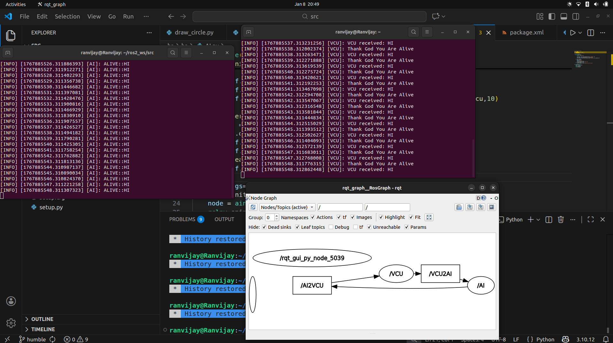

## Program Output

Snake game
[Click here to watch the gameplay video](snake_game_vid.webm)

##ROS2 Assignment
First i created a node which only publishes (AI) the message that 
it is alive 
Then a subcriber(VCU) which listens the message of AI and responds
after checking if its alive

Then i made both the nodes publisher and subscribers using 2 topis 
VCU2AI
AI2VCU
see files  AI.py and VCU.py

#Final ROS Assignment

Module 1 done 
